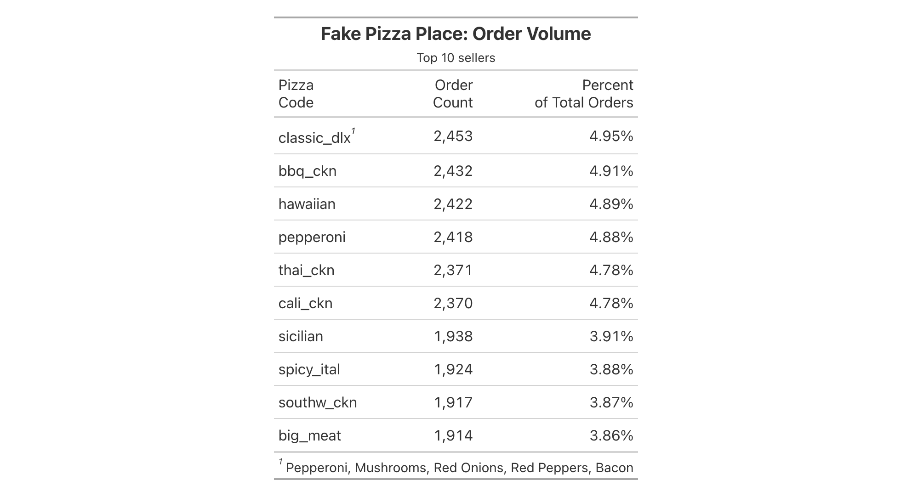
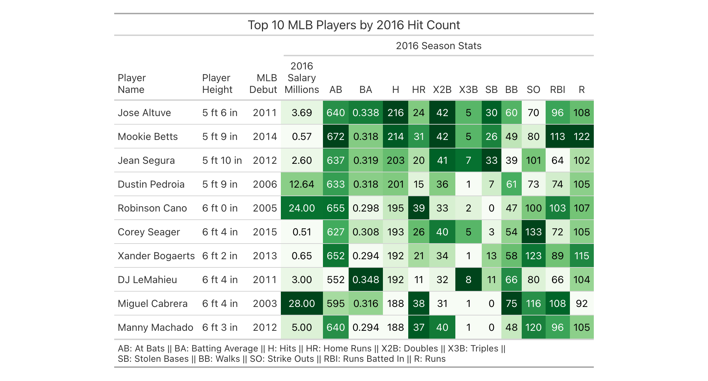
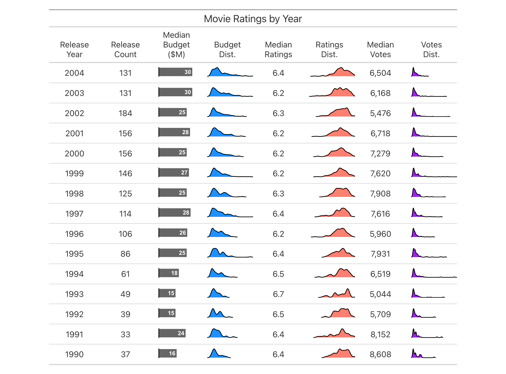
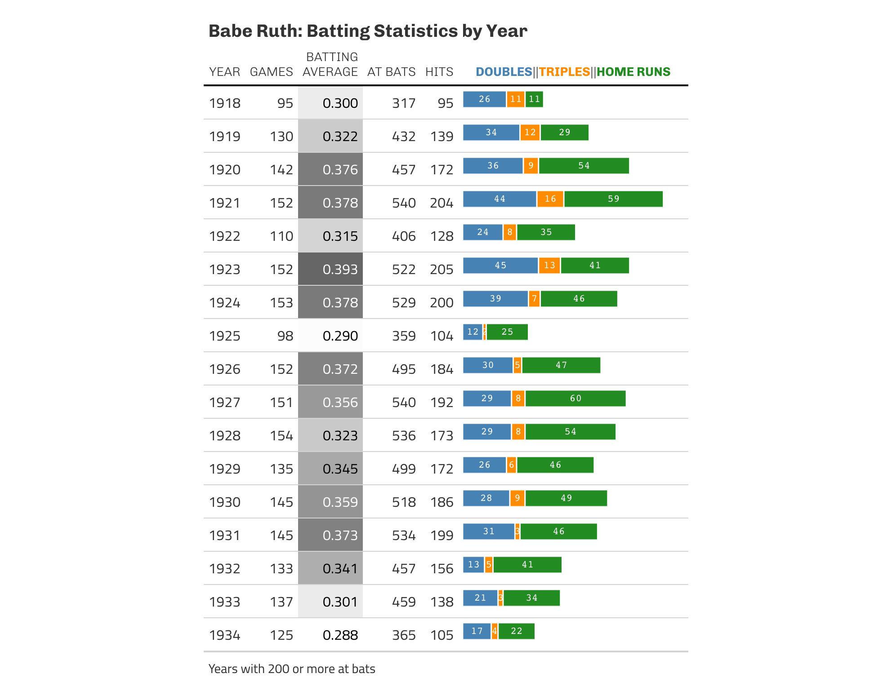
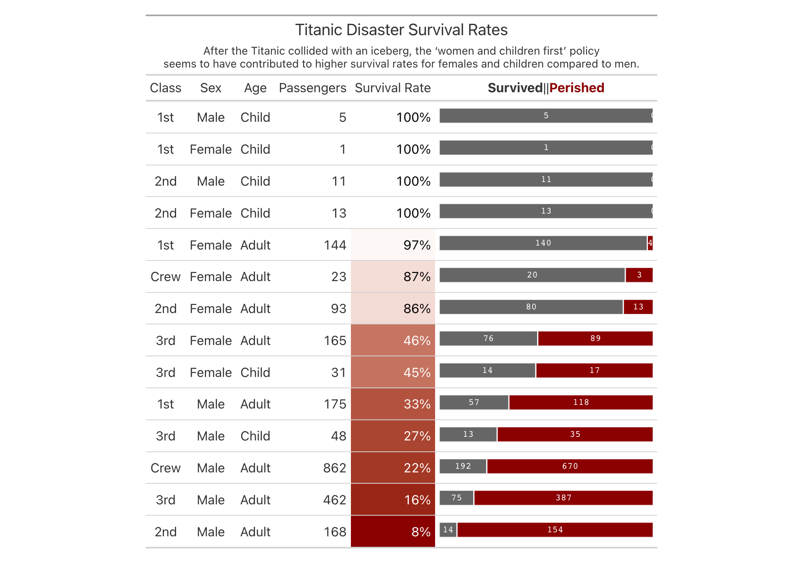
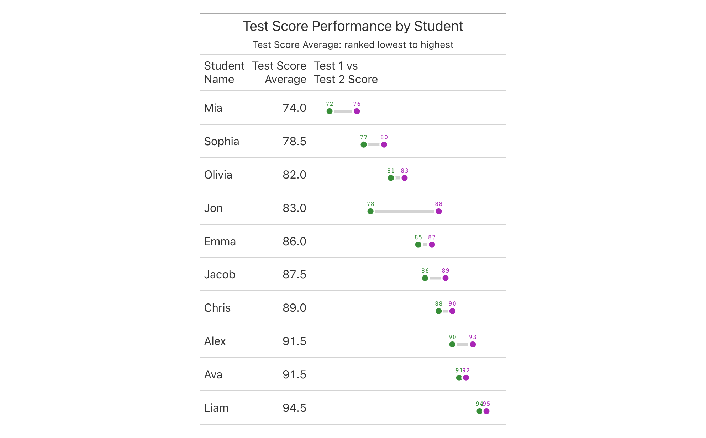
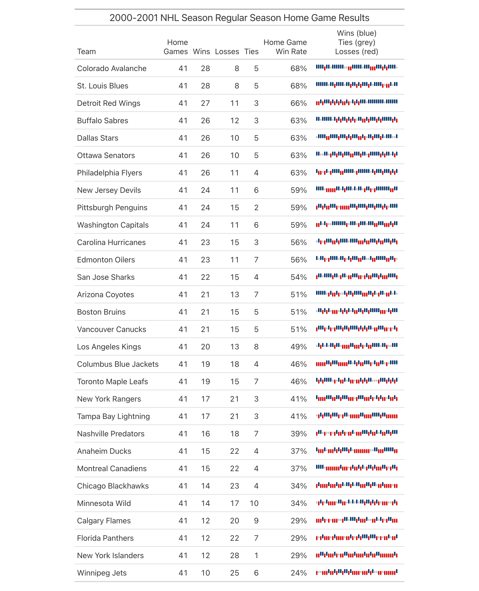

# Table Visualizations with gt & gtExtras

### Notebook Objectives

- Practice table data visualizations with gt and gtExtras.

``` r
options(scipen=999)

required_packages <- c('tidyverse', 'janitor', 'gt', 'gtExtras', 'ggplot2movies',
                       'htmltools', 'lubridate', 'NHLData', 'Lahman')

for(p in required_packages) {
  if(!require(p,character.only = TRUE)) 
        install.packages(p, repos = "http://cran.us.r-project.org")
  library(p,character.only = TRUE)
}
```

### Basic table example

- Pizza data source from gt package.

``` r
gt_pizza <- pizzaplace |>
  tabyl(name) |>
  slice_max(n, n = 10) |>
  gt() |>
  fmt_number(columns = n, decimals = 0) |>
  fmt_percent(columns = percent, decimals = 2) |>
  tab_header(
    ### can style using markdown
    title = md("**Fake Pizza Place: Order Volume**"),
    subtitle = "Top 10 sellers"
  ) |>
  cols_label(
    name = "Pizza<br>Code",
    n = "Order<br>Count",
    percent = "Percent<br>of Total Orders",
    .fn = md
  ) |> 
  tab_footnote(
    footnote = "Pepperoni, Mushrooms, Red Onions, Red Peppers, Bacon",
    locations = cells_body(columns = name, rows = 1)
  )
 
gt_pizza |> gtsave_extra("figs/pizza_table.png")
```



### Conditional Formatting Example

- MLB data source from R Lahman package.
- Common spreadsheet use case where color is used to highlight low vs
  high values per variable.

``` r
batting_2016_most_hits <- Batting |> 
  filter(yearID == 2016) |>
  arrange(desc(H)) |>
  slice(1:10) |>
  mutate(BA = H/AB)

salaries_join <- Salaries |> select(playerID, yearID, salary) |>
  mutate(salary_mil = salary/1000000)

people_join <- People |> select(playerID, nameFirst, nameLast, height, debut) |>
  mutate(height = paste0(floor(height/12), " ft ", 
                                  height - floor(height/12)*12, " in"),
         name = paste0(nameFirst, " ", nameLast),
         debut_year = year(debut))

top10_by_hits <- batting_2016_most_hits |>
      left_join(salaries_join, 
                by=c("playerID", "yearID")) |>
      left_join(people_join,
                by=c("playerID")) |>
      select(name, height, debut_year, salary_mil, AB, BA, H, HR, X2B, X3B, SB, BB, SO, RBI, R)

gt_hits <- top10_by_hits |>
      gt() |>
      gt_color_rows(salary_mil:R, palette = "RColorBrewer::Greens") |>
      tab_header(
            title = "Top 10 MLB Players by 2016 Hit Count"
      ) |>
      tab_spanner(
            label = "2016 Season Stats",
            columns = salary_mil:R
      ) |>
      tab_options(
            table.font.size = 14,
            table.align="center"
      ) |>
      cols_align(
            align = "center",
            columns = salary_mil:R
      ) |>
      fmt_number(salary_mil, decimals = 2) |>
      fmt_number(BA, decimals = 3) |>
      cols_label(
        name = "Player<br>Name",
        height = "Player<br>Height",
        debut_year = "MLB<br>Debut",
        salary_mil = "2016<br>Salary<br>Millions",
        .fn = md
      ) |>
      tab_footnote(
            footnote = md("AB: At Bats || BA: Batting Average || H: Hits || HR: Home Runs || 
            X2B: Doubles || X3B: Triples ||<br>SB: Stolen Bases || BB: Walks || SO: Strike Outs || 
            RBI: Runs Batted In || R: Runs"),
      )

gt_hits |> gtsave_extra("figs/hits_table.png")
```



### Add plots to gt table cell

- Movies data source from ggplot2movies R package.
- Example showing summary statistics and data plots in table cells.

``` r
movies_tab_df <- 
  ggplot2movies::movies|>
  filter(year>=1990,
         year<=2004,
         votes>=1000,
         !is.na(budget)) |>
  group_by(year) |>
  summarize(
    sample_size = n(),
    median_budget = median(budget),
    budgets = list(budget), 
    median_ratings = median(rating),
    ratings = list(rating),
    median_votes = median(votes),
    votes = list(votes),
    .groups = "drop") |>
    arrange(desc(year))

gt_movies <- movies_tab_df |>
    gt() |>
    gt_plt_bar(column = median_budget, 
               width = 20,
               color = "grey40", alpha = 0.65,
               scale_type = "number",
               scale = 1/1000000) |>
    gt_plt_dist(budgets, fill_color = "dodgerblue") |>
    gt_plt_dist(ratings, fill_color = "salmon") |>
    gt_plt_dist(votes, fill_color = "purple") |>
    fmt_number(columns = median_votes,
                decimals = 0,
                use_seps = TRUE) |>
    fmt_number(columns = median_ratings,
                decimals = 1) |>
    cols_label(
      year = "Release<br>Year",
      sample_size = "Release<br>Count",
      median_budget = "Median<br>Budget ($M)",
      budgets = "Budget<br>Dist.",
      median_ratings = "Median<br>Ratings",
      ratings = "Ratings<br>Dist.",
      median_votes = "Median<br>Votes",
      votes = "Votes<br>Dist.",
      .fn = md
    ) |>
    cols_width(
      everything() ~ px(100)
    ) |>
    cols_align(
      align = c("center"),
      columns = everything()
    ) |>
    tab_header(title = "Movie Ratings by Year") 

gt_movies |> gtsave_extra("figs/movies_table.png")
```



### Count Bar Plots with gtExtras

- Bar plot to supplement table statistics
- Note: function takes only 2 or 3 groups ([package
  documentation](https://jthomasmock.github.io/gtExtras/reference/gt_plt_bar_stack.html)).
  For more than 3 groups, regrouping could be explored.
- Babe Ruth batting statistics from R plyr package baseball dataset.

``` r
babe_ruth <- plyr::baseball |>
  filter(id == "ruthba01", ab >= 200) |>
  group_by(year, g, batting_average = h/ab, ab, h) |>
  summarise(data_list = list(c(X2b, X3b, hr)),
            .groups = "drop") 

gt_ruth <- babe_ruth |>
  gt() |>
  fmt_number(columns = batting_average, decimals = 3) |>
  gt_color_rows(batting_average, palette = c("white", "grey40")) |>
  gt_plt_bar_stack(data_list,
                   position = 'stack',
                   palette = c("steelblue", "darkorange", "forestgreen"),
                   labels = c("Doubles", "Triples", "Home Runs"),
                   width = 65) |>
  ### for fun, use 538 plot theme
  gt_theme_538() |>
  tab_footnote(
    footnote = "Years with 200 or more at bats"
  ) |>
  tab_header(
    title = "Babe Ruth: Batting Statistics by Year"
  ) |>
  cols_label(
      year = "Year",
      g = "Games",
      ab = "At Bats",
      h = "Hits",
      batting_average = "Batting<br>Average",
      .fn = md
    )

gt_ruth |> gtsave_extra("figs/babe_ruth_table.png")
```



### Percent Total Bar Plots with gtExtras

- Titanic data source from R datasets package.

``` r
titanic_setup <- as_tibble(as.data.frame(Titanic)) |> 
  group_by(Class, Sex, Age) |>
  summarise(survived_count = sum(ifelse(Survived=="Yes", Freq, 0)),
            perished_count = sum(ifelse(Survived=="No", Freq, 0)),
            p = sum(Freq),
            sr = survived_count/p) |>
  filter(p>=1) |>
  group_by(Class, Sex, Age, p, sr) |>
  summarise(data_list = list(c(survived_count, perished_count)),
            .groups = "drop") |>
  arrange(desc(sr))

gt_titanic <- titanic_setup |>
  gt() |>
  fmt_percent(columns = sr, decimals = 0) |>
  gt_color_rows(sr, palette = c("darkred", "white")) |>
  gt_plt_bar_stack(column = data_list,
                   palette = c("grey40", "darkred"),
                   labels = c("Survived", "Perished")) |>
  cols_label(
    p = "Passengers",
    sr = "Survival Rate"
  )  |> 
  tab_header(
    title = "Titanic Disaster Survival Rates",
    subtitle = md(
      "After the Titanic collided with an iceberg, the 
      'women and children first' policy<br>seems to have contributed to higher 
      survival rates for females and children compared to men."
    )
  )

gt_titanic |> gtsave_extra("figs/titanic_table.png")
```



### Table Sparklines with gtExtras

- Airline passengers data from R datasets package.

``` r
start_year <- start(AirPassengers)[1]
start_month <- start(AirPassengers)[2]
end_year <- end(AirPassengers)[1]
end_month <- end(AirPassengers)[2]

start_date <- as.Date(sprintf("%04d-%02d-01", start_year, start_month))
end_date <- as.Date(sprintf("%04d-%02d-01", end_year, end_month))

air_passengers_tbl <- tibble(
  month = seq(start_date, end_date, by = "month"),
  passengers = as.numeric(AirPassengers)
)

gt_ap_setup <- air_passengers_tbl |>
  group_by(year = year(month)) |>
  summarise(
    average_passengers = mean(passengers),
    median_passengers = median(passengers),
    international_airline_passengers = list(passengers),
    max_pass_inds = which(passengers == max(passengers)),
    min_pass_inds = which(passengers == min(passengers)),
    max_month = paste(month(month[max_pass_inds], label = TRUE, abbr = TRUE), collapse = ", "),
    min_month = paste(month(month[min_pass_inds], label = TRUE, abbr = TRUE), collapse = ", "),
    .groups = "drop"
  ) |>
  select(-max_pass_inds, -min_pass_inds)

gt_airline_passengers <- gt_ap_setup |>
  gt() |>
  fmt_number(columns = c(average_passengers, median_passengers), decimals = 0) |>
  gt_plt_sparkline(international_airline_passengers, 
                   same_limit = F,
                   type = "shaded",
                   fig_dim = c(15, 45),
                   label = F) |>
  cols_label(
    year = "Year",
    average_passengers = "Average<br>Passengers",
    median_passengers = "Median<br>Passengers",
    international_airline_passengers = "Passenger Volume<br>Trend (thousands)",
    max_month = "Month with<br>Most Passengers",
    min_month = "Month with<br>Least Passengers",
    .fn = md
  ) |>
  tab_header(
    title = "Airline Passenger Volume Trends by Year",
  )

gt_airline_passengers |> gtsave_extra("figs/airline_passengers_table.png")
```


### Dumbbell plot with gtExtras

- Manually curated fake test scores data.

``` r
student_scores <- 
  data.frame(
    student = c("Jon", "Emma", "Alex", "Mia", "Chris", "Olivia", 
              "Liam", "Sophia", "Jacob", "Ava"),
    test1 = c(78, 85, 90, 72, 88, 81, 94, 77, 86, 91),
    test2 = c(88, 87, 93, 76, 90, 83, 95, 80, 89, 92)
  ) |>
  mutate(avg_score = (test1 + test2)/2) |>
  select(student, avg_score, everything())

# Create the basic dumbbell plot
gt_test_scores <- student_scores |>
  arrange(avg_score) |>
  gt() |>
  gt_plt_dumbbell(col1 = test1, col2 = test2) |>
  cols_label(
    student = "Student<br>Name",
    avg_score = "Test Score<br>Average",
    test1 = "Test 1 vs<br>Test 2 Score",
    
    .fn = md
  ) |> 
  tab_header(
    title = "Test Score Performance by Student",
    subtitle = "Test Score Average: ranked lowest to highest"
  ) 

gt_test_scores |> gtsave_extra("figs/test_scores_table.png")
```



### Win loss plot with gtExtras

- NHL game results data from NHLData R package.

``` r
### future improvement: could add team logos to table visualization
### this package might be able to help: https://rdrr.io/cran/hockeyR/man/team_logos_colors.html
home_game_results <- Sch0001 |>
  filter(Playoff=="N") |>
  group_by(Home, Date) |>
  summarise(outcome = case_when(
    Tie == "Y" ~ 0.5,
    GDH > 0 ~ 1,
    GDH < 0 ~ 0
  )) |>
  group_by(Home) |>
  arrange(Home, Date)

home_game_results_agg <- home_game_results |>
  group_by(team = Home) |>
  summarise(home_games = n(),
            wins = sum(outcome==1), 
            losses = sum(outcome==0),
            ties = sum(outcome==0.5),
            home_game_win_rate = wins / n(),
            data_list = list(outcome)) |>
  ungroup()

gt_win_loss <- home_game_results_agg |>
  arrange(desc(home_game_win_rate)) |>
  gt() |>
  fmt_percent(columns = home_game_win_rate, decimals = 0) |>
  gt_plt_winloss(column = data_list, max_wins = 41) |>
  cols_label(
    team = "Team",
    home_games = "Home<br>Games",
    wins = "Wins",
    losses = "Losses",
    ties = "Ties",
    home_game_win_rate = "Home Game<br>Win Rate",
    data_list = "Wins (blue)<br>Ties (grey)<br>Losses (red)",
    .fn = md
  ) |> 
  tab_header(
    title = "2000-2001 NHL Season Regular Season Home Game Results",
  ) 

gt_win_loss |> gtsave_extra("figs/win_loss_table.png")
```


